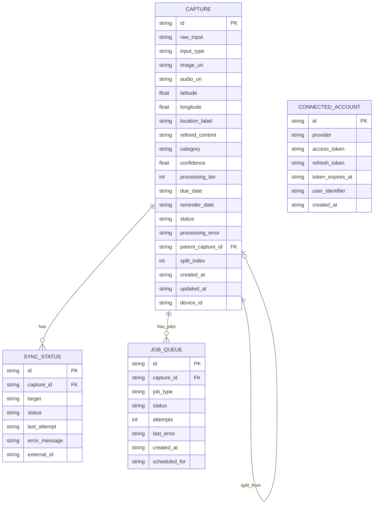

# CaptureDo: Blazingly Fast Capture-First Productivity App

**Type:** Feature (New Application)
**Created:** 2026-01-21
**Status:** Planning
**Deepened:** 2026-01-22

---

## Enhancement Summary

**Deepened on:** 2026-01-22
**Sections enhanced:** 8
**Review agents used:** Architecture Strategist, Performance Oracle, Security Sentinel, TypeScript Reviewer, Code Simplicity Reviewer, Agent-Native Reviewer, Pattern Recognition Specialist

### Key Improvements Discovered

1. **Security Critical:** OAuth flows need PKCE + state parameter validation; SQLite encryption must use SQLCipher
2. **Architecture:** Add version vectors for optimistic locking to prevent race conditions in fire-and-forget pattern
3. **Performance:** Cold start viable with progressive loading; reframe "100ms done" as "100ms acknowledged"
4. **Type Safety:** Use discriminated unions for Capture types; branded types for dates and confidence scores
5. **Agent Parity:** Current MCP design is only 25% agent-capable; need create/edit/delete tools

### Simplifications Applied

| Feature | Status |
|---------|--------|
| 4-Tier Processing | ✅ Simplified to 2-tier (Regex + Llama) |
| Dynamic Categories | ✅ Fixed to 5 categories: task, idea, shopping, reminder, note |
| MCP Desktop Bridge | ✅ **REMOVED** - Using direct API push instead |
| TinyML Classifier | ✅ **REMOVED** - Unnecessary complexity |
| 6 Database Tables | ✅ Reduced to 4 tables (removed category merge tracking) |

### Critical Pre-Launch Checklist

- [ ] Implement PKCE in all OAuth flows
- [ ] Verify SQLCipher encryption is active
- [ ] Add memory warning handlers (unload LLM on iOS pressure)
- [ ] Implement optimistic UI with background reconciliation
- [ ] Add error handling to batch processing with retry logic

---

## Overview

CaptureDo is a cross-platform mobile app (iOS + Android) that enables users to capture thoughts, ideas, and tasks with **zero friction**. The app operates on a "**Fire and Forget**" philosophy - users never wait, never approve, never manage. They capture and move on.

**Core Philosophy: Fire and Forget**
- Input → Enter → **Item flies away** → Input clears instantly
- **Zero latency** - the user NEVER waits for the LLM
- All processing happens asynchronously in the background
- No "review" step - items are auto-approved and queued for sync immediately

**One Screen Philosophy:**
- **CAPTURE** - The entire app is ONE screen, 100% dedicated to capture
- **Smart List** - Accessible via list icon (top-right), slides up as a modal sheet
- No bottom tabs. No red badges. No distractions. Pure "Zen capture."

**Smart List Modal:**
- Filter chips: `[All] [Today] [Work] [Idea] [Shopping] ...`
- Auto-grouped by urgency: `Overdue → Today → Upcoming → No Date`
- Swipe right to complete/archive, swipe left to delete
- Tap to view details and make corrections

**Sync Philosophy:** Mobile app pushes directly to connected services (Todoist, Apple Reminders, Claude, ChatGPT) via OAuth. No desktop bridge required.

**Key Differentiator:** True "fire and forget" capture. On-device AI processing happens silently in background - user experiences instant capture with no wait states.

---

## Problem Statement

Current productivity apps suffer from:

1. **Friction at capture** - Too many taps/screens before you can capture
2. **Manual organization** - Users must categorize, tag, and schedule items themselves
3. **Context loss** - Quick captures lack the detail needed to act on later
4. **Platform silos** - Captured items don't flow to where users actually plan/work

**User Pain Point:** "By the time I open my todo app and navigate to the right list, I've forgotten what I wanted to capture."

---

## Proposed Solution

### Architecture Overview: Async Queue-Based Processing

**Critical Design Principle:** The UI layer is completely decoupled from processing. User NEVER waits.

```
┌─────────────────────────────────────────────────────────────────────────────┐
│                         CaptureDo Mobile App                                 │
│                        (ONE SCREEN - Pure Capture)                           │
├─────────────────────────────────────────────────────────────────────────────┤
│                                                                              │
│   ┌─────────────────────────────────────────────────────────────────────┐   │
│   │                      CAPTURE SCREEN (100%)                           │   │
│   │                                                                      │   │
│   │   [Gear]                                              [List Icon]   │   │
│   │                                                       (no badge!)    │   │
│   │                                                                      │   │
│   │   ┌───────────────────────────────────────────────────────────┐     │   │
│   │   │ |                                                         │     │   │
│   │   │              (Cursor Blinking - Ready to Type)            │     │   │
│   │   └───────────────────────────────────────────────────────────┘     │   │
│   │                                                                      │   │
│   │                    [MIC]        [CAM]                                │   │
│   │                                                                      │   │
│   │   Enter → Fly Away Animation → Input Clears INSTANTLY               │   │
│   │                                                                      │   │
│   └─────────────────────────────────────────────────────────────────────┘   │
│               │                                                              │
│               │ IMMEDIATE (no wait)                                          │
│               ▼                                                              │
│   ┌─────────────────────────────────────────────────────────────────────┐   │
│   │                    SQLite (Raw Captures)                             │   │
│   │   Save raw input instantly. User flow ENDS here.                     │   │
│   └───────────────────────────────────┬─────────────────────────────────┘   │
│                                       │                                      │
│   ┌ ─ ─ ─ ─ ─ ─ ─ ─ ─ ─ ─ ─ ─ ─ ─ ─ ─│─ ─ ─ ─ ─ ─ ─ ─ ─ ─ ─ ─ ─ ─ ─ ─ ┐   │
│     SMART LIST MODAL (slides up)      │                                      │
│   │ ┌─────────────────────────────────│─────────────────────────────────┐│   │
│     │ [All] [Today] [Work] [Idea] →   │  ← Filter Chips                  │   │
│   │ │─────────────────────────────────│─────────────────────────────────││   │
│     │ ▼ OVERDUE                       │                                  │   │
│   │ │ ▼ TODAY                         │                                  ││   │
│     │ ▼ UPCOMING                      │                                  │   │
│   │ │ ▼ NO DATE                       │                                  ││   │
│     │ Swipe → Complete | Swipe ← Delete | Tap → Details                  │   │
│   │ └───────────────────────────────────────────────────────────────────┘│   │
│   └ ─ ─ ─ ─ ─ ─ ─ ─ ─ ─ ─ ─ ─ ─ ─ ─ ─ ─ ─ ─ ─ ─ ─ ─ ─ ─ ─ ─ ─ ─ ─ ─ ─ ┘   │
│                                       │                                      │
│                                       │ ASYNC (background)                   │
│                                       ▼                                      │
│   ┌─────────────────────────────────────────────────────────────────────┐   │
│   │                    Background Worker                                 │   │
│   │  ┌─────────────────────────────────────────────────────────────┐    │   │
│   │  │              Hybrid Processing Engine (2-Tier)               │    │   │
│   │  │                                                              │    │   │
│   │  │  Tier 1: Regex/Heuristics (instant, ~0 battery)             │    │   │
│   │  │  Tier 2: Llama 3.2 1B (for complex captures)                │    │   │
│   │  └─────────────────────────────────────────────────────────────┘    │   │
│   │  Also: whisper.rn (Voice STT), Batch Processing                     │   │
│   └───────────────────────────────────┬─────────────────────────────────┘   │
│                                       │                                      │
│                                       ▼                                      │
│   ┌─────────────────────────────────────────────────────────────────────┐   │
│   │                    SQLite (Refined Captures)                         │   │
│   │   category • due_date • location • audio_uri • tags                  │   │
│   └───────────────────────────────────┬─────────────────────────────────┘   │
│                                       │                                      │
│                                       │ AUTO-SYNC (background)               │
│                                       ▼                                      │
│   ┌─────────────────────────────────────────────────────────────────────┐   │
│   │                    Sync Engine (Direct API Push)                     │   │
│   │   • Todoist API (OAuth) - tasks with due dates                      │   │
│   │   • Apple Reminders (native) - location/time reminders              │   │
│   │   • Claude API (OAuth) - context for AI conversations               │   │
│   │   • ChatGPT API (OAuth) - context for AI conversations              │   │
│   └─────────────────────────────────────────────────────────────────────┘   │
│                                                                              │
└──────────────────────────────────────────────────────────────────────────────┘
```

### Cold Start Strategy

**The app MUST accept input immediately** - before llama.rn loads into memory.

```
App Launch Timeline:
──────────────────────────────────────────────────────────────────────→

[0ms]     UI renders, keyboard opens, cursor blinks
          ↓ User can type IMMEDIATELY

[100ms]   SQLite ready - captures can be saved

[500ms]   Whisper model loading (background thread)

[1-3s]    Llama model loading (background thread)
          ↓ Any captures during this time go to queue

[Ready]   Background processing catches up
```

#### Research Insights: Cold Start & Architecture

**Performance Findings:**
- Cold start <1s is achievable but requires progressive model loading
- LLM won't be ready at cold start - Tier 1 (regex) handles initial captures
- Memory-mapped model loading reduces resident memory from 700MB to ~400MB

**Architecture Concerns Identified:**

1. **Race Condition Risk:** User edits capture while processing completes
   ```typescript
   // Recommended: Version vectors for optimistic locking
   interface Capture {
     version: number;           // Increment on each modification
     userModifiedAt?: Date;     // Track manual edits
     processingVersion?: number; // Version when processing started
   }
   ```

2. **Queue Persistence Gap:** App crash during processing loses queue state
   - Use SQLite-backed durable queue with atomic status transitions
   - Add `lockedUntil` field to prevent duplicate processing

3. **LLM Loading Failure:** Silent failure if LLM can't load (memory pressure)
   ```typescript
   // Recommended: Health monitoring
   interface LLMHealth {
     status: 'loading' | 'ready' | 'failed' | 'degraded';
     fallbackActive: boolean;
   }
   ```

**Staged Initialization Recommendation:**
```typescript
// Stage 1: Critical path (< 100ms)
await initializeNavigation();
renderPlaceholderUI();

// Stage 2: Data layer (< 500ms)
await initializeSQLite();
renderFullUI();

// Stage 3: LLM (background, non-blocking, deferred 1s after UI settles)
setTimeout(() => initializeLlama(), 1000);
```

### Screen Structure

**ONE SCREEN - No Bottom Tabs - Pure Capture Focus**

| Element | Location | Purpose |
|---------|----------|---------|
| Gear Icon | Top-left header | Opens Settings (modal) |
| List Icon | Top-right header | Opens Smart List (modal) - **NO BADGE** |
| Input Area | Center | Text capture with auto-focus |
| MIC / CAM | Below input | Voice and photo capture triggers |
| Keyboard | Bottom | Auto-opens on launch |

**"Zen Capture" Principle:** No badges, no notification counts, no distractions on the capture screen. Due date reminders use System Push Notifications instead.

### Tech Stack

| Layer | Technology | Rationale |
|-------|------------|-----------|
| **Framework** | React Native 0.81 + Expo SDK 54 | Single codebase, New Architecture default, fast builds |
| **On-Device LLM** | llama.rn + Llama 3.2 1B (Q4_K_M) | 20-35 tok/s, Tier 2 processing, Metal/NPU acceleration |
| **Speech-to-Text** | whisper.rn (offline) | Privacy-first, high accuracy, no network needed |
| **Local Storage** | expo-sqlite | Fast, reliable, offline-first |
| **Job Queue** | Custom + expo-background-fetch | Async processing, survives app close |
| **State Management** | Zustand | Minimal boilerplate, excellent performance |
| **Navigation** | expo-router | File-based routing, deep linking support |
| **Auth** | expo-auth-session | OAuth flows for external services |
| **Sync (Push)** | Direct API calls | Todoist, Claude, ChatGPT via OAuth |
| **Reminders** | Native iOS/Android APIs | Apple Reminders + Android equivalent |
| **Location** | expo-location | Background location capture |

---

## Technical Approach

### Data Model

```typescript
// src/types/capture.ts

interface Capture {
  id: string;                          // UUID v4

  // Raw input (ALWAYS preserved)
  rawInput: string;                    // Original text/transcript
  inputType: 'text' | 'voice' | 'image';
  imageUri?: string;                   // Path to photo if applicable
  audioUri?: string;                   // Path to ORIGINAL voice recording (ALWAYS kept)

  // Location context (captured at input time)
  latitude?: number;
  longitude?: number;
  locationLabel?: string;              // Reverse geocoded: "Starbucks, Main St"

  // LLM-processed output
  refinedContent: string;              // Cleaned, enriched text
  category: CaptureCategory;
  confidence: number;                  // 0-1 LLM confidence score
  processingTier: 1 | 2;               // Tier 1: Regex, Tier 2: Llama

  // Extracted entities
  dueDate?: string;                    // ISO8601
  reminderDate?: string;               // ISO8601
  extractedPeople?: string[];          // Names mentioned
  extractedLocations?: string[];       // Places mentioned
  tags?: string[];                     // Auto-generated tags

  // Brain Dump support
  parentCaptureId?: string;            // If this was split from a larger capture
  splitIndex?: number;                 // Order in the split (1, 2, 3...)

  // Status (NO "pending_review" - fire and forget!)
  status: CaptureStatus;
  processingError?: string;

  // Sync state
  syncTargets: SyncTarget[];           // Where to sync
  syncStatus: SyncStatusRecord[];      // Sync history per target

  // Metadata
  createdAt: string;                   // ISO8601
  updatedAt: string;                   // ISO8601
  deviceId: string;
  appVersion: string;
}

// Fixed categories - simple and predictable
type CaptureCategory = 'task' | 'idea' | 'shopping' | 'reminder' | 'note';

// Category definitions
const CATEGORIES: Record<CaptureCategory, { label: string; color: string }> = {
  task: { label: 'Task', color: '#3B82F6' },      // Actionable item
  idea: { label: 'Idea', color: '#8B5CF6' },      // Creative thought
  shopping: { label: 'Shopping', color: '#10B981' }, // Shopping list item
  reminder: { label: 'Reminder', color: '#F59E0B' }, // Time/location reminder
  note: { label: 'Note', color: '#6B7280' },      // General information
};

// FIRE AND FORGET - no "pending_review" state!
type CaptureStatus =
  | 'raw'             // Just captured, in queue for processing
  | 'processing'      // Background worker handling it
  | 'ready'           // Processed, queued for sync
  | 'syncing'         // Sync in progress
  | 'synced'          // Successfully synced
  | 'failed'          // Processing or sync failed
  | 'deleted';        // Soft deleted

type SyncTarget = 'todoist' | 'reminders' | 'claude' | 'chatgpt';

interface SyncStatusRecord {
  target: SyncTarget;
  status: 'pending' | 'syncing' | 'success' | 'failed';
  lastAttempt?: string;
  errorMessage?: string;
  externalId?: string;  // ID from external system if available
}
```

#### Research Insights: Type Safety Improvements

**Critical Issues Found:**

1. **`CaptureCategory = string` is too loose** - Provides zero compile-time safety
2. **`confidence: number` allows invalid values** - `confidence: 500` compiles fine
3. **Optional media URIs break invariants** - Voice captures should REQUIRE `audioUri`

**Recommended Type Improvements:**

```typescript
// Branded types for compile-time safety
type ISODateString = string & { readonly __brand: 'ISODateString' };
type ConfidenceScore = number & { readonly __brand: 'ConfidenceScore' };

// Discriminated union enforces media requirements
interface TextCapture extends CaptureBase {
  inputType: 'text';
  imageUri?: never;
  audioUri?: never;
}

interface VoiceCapture extends CaptureBase {
  inputType: 'voice';
  audioUri: string;  // REQUIRED - not optional!
  imageUri?: never;
}

interface ImageCapture extends CaptureBase {
  inputType: 'image';
  imageUri: string;  // REQUIRED - not optional!
  audioUri?: never;
}

type Capture = TextCapture | VoiceCapture | ImageCapture;

// Type guards
function isVoiceCapture(c: Capture): c is VoiceCapture {
  return c.inputType === 'voice';
}
```

**Applied Simplification:** Using 5 fixed categories instead of dynamic:
```typescript
type CaptureCategory = 'task' | 'idea' | 'shopping' | 'reminder' | 'note';
```

### Hybrid Processing Engine (2-Tier)

Simple 2-tier system to balance speed and intelligence:

```typescript
// src/services/processing/hybridEngine.ts

/**
 * TIER 1: Regex/Heuristics (instant, ~0 battery)
 * Handles simple, well-structured inputs without invoking the LLM.
 * Handles ~30% of captures with zero battery cost.
 */
const SIMPLE_PATTERNS: Record<CaptureCategory, RegExp> = {
  reminder: /^remind(?:er)?:?\s+(?:me\s+)?(.+?)\s+(?:at|on)\s+(.+)$/i,
  task: /^(?:todo|task|do):?\s+(.+)$/i,
  shopping: /^(?:buy|get|pick up|grocery|groceries):?\s+(.+)$/i,
  idea: /^(?:idea|thought):?\s+(.+)$/i,
  note: /^(?:note|remember):?\s+(.+)$/i,
};

function tryTier1(rawInput: string): ProcessedCapture | null {
  for (const [category, pattern] of Object.entries(SIMPLE_PATTERNS)) {
    const match = rawInput.match(pattern);
    if (match) {
      return {
        refinedContent: match[1].trim(),
        category: category as CaptureCategory,
        processingTier: 1,
        confidence: 0.95,
        dueDate: extractDateFromText(match[2] || null),
      };
    }
  }
  return null;  // Fall through to Tier 2
}

/**
 * TIER 2: Llama 3.2 1B (for all other captures)
 * Full refinement, categorization, entity extraction.
 * Also handles brain dump detection and splitting.
 */
async function processTier2(rawInput: string): Promise<ProcessedCapture | ProcessedCapture[]> {
  const context = await getLlamaContext();
  const result = await context.completion({
    prompt: `${SYSTEM_PROMPT}\n\nCapture: "${rawInput}"\n\nJSON:`,
    n_predict: 512,
    temperature: 0.3,
    grammar: captureJsonGrammar,
  });
  return JSON.parse(result.text);
}

/**
 * Main processing pipeline (2-tier)
 */
async function processCapture(rawInput: string): Promise<{
  captures: ProcessedCapture[];
  wasSplit: boolean;
  tier: 1 | 2;
}> {
  // TIER 1: Try simple patterns first (instant, ~0 battery)
  const tier1Result = tryTier1(rawInput);
  if (tier1Result) {
    return { captures: [tier1Result], wasSplit: false, tier: 1 };
  }

  // TIER 2: Use Llama for everything else
  const result = await processTier2(rawInput);

  // Handle brain dump splitting (Llama returns array if multiple items detected)
  if (Array.isArray(result)) {
    return { captures: result, wasSplit: result.length > 1, tier: 2 };
  }

  return { captures: [result], wasSplit: false, tier: 2 };
}

/**
 * BATCH PROCESSING: If multiple captures arrive quickly,
 * spin up Llama once to process the batch (not once per item).
 */
async function processBatch(captures: RawCapture[]): Promise<BatchResult> {
  const result: BatchResult = { successful: [], failed: [] };
  let context: LlamaContext | null = null;

  try {
    context = await getLlamaContext();  // Single load

    const results = await Promise.allSettled(
      captures.map(async (capture) => {
        const processed = await processCapture(capture.rawInput);
        await saveProcessedCapture(capture.id, processed);
        return capture.id;
      })
    );

    // Categorize results
    for (const [i, r] of results.entries()) {
      if (r.status === 'fulfilled') {
        result.successful.push(r.value);
      } else {
        result.failed.push({ id: captures[i].id, error: r.reason });
      }
    }
  } finally {
    if (context) await context.release();  // Always cleanup
  }

  return result;
}
```

**Battery Analysis (2-Tier):**
- Tier 1 (Regex): ~0.001 mAh per capture - handles ~30% of inputs
- Tier 2 (Llama): ~0.5-2.0 mAh per capture - handles remaining 70%
- **Target <3% battery per 50 captures is achievable** with proper tier routing

### Brain Dump Mode

When the input contains multiple distinct ideas, the LLM splits them into separate records.

```typescript
// src/services/processing/brainDump.ts

const BRAIN_DUMP_PROMPT = `You are a capture assistant handling a "brain dump" - a stream of consciousness with multiple distinct ideas.

Your job:
1. Identify EACH distinct idea, task, or thought in the input
2. Split them into separate items
3. Refine each item individually
4. Assign one of the 5 fixed categories: task, idea, shopping, reminder, note

SPLITTING RULES:
- "Buy milk AND call mom AND fix the fence" → 3 separate items
- "Meeting notes: discussed budget, need to follow up with Sarah, also remember to book flights" → 3 separate items
- A single coherent thought stays as one item, even if long

CATEGORIES (choose ONE per item):
- task: Actionable item that needs to be done
- idea: Creative thought or concept to explore
- shopping: Item to purchase
- reminder: Time or location-based reminder
- note: General information to remember

For EACH item, output:
{
  "refinedContent": "string",
  "category": "task" | "idea" | "shopping" | "reminder" | "note",
  "confidence": 0.0-1.0,
  "dueDate": "ISO8601 or null",
  "tags": ["string"]
}

Output as JSON array:
[{ item1 }, { item2 }, { item3 }]`;

async function processBrainDump(rawInput: string): Promise<ProcessedCapture[]> {
  const context = await getLlamaContext();

  const result = await context.completion({
    prompt: `${BRAIN_DUMP_PROMPT}\n\nBrain dump: "${rawInput}"\n\nJSON array:`,
    n_predict: 1024,  // Longer output for multiple items
    temperature: 0.3,
    grammar: brainDumpJsonGrammar,
  });

  const items = JSON.parse(result.text);
  return items.map((item: any, index: number) => ({
    ...item,
    processingTier: 3,
    splitIndex: index + 1,
  }));
}
```

### Brain Dump UX: Subtle Notification

When a capture is split, show a **brief toast notification** with undo option.

```typescript
// src/components/SplitNotification.tsx

interface SplitNotificationProps {
  count: number;
  onUndo: () => void;
}

function SplitNotification({ count, onUndo }: SplitNotificationProps) {
  // Auto-dismiss after 4 seconds
  // Shows: "Split into 3 items" with [Undo] button

  return (
    <Toast duration={4000}>
      <Text>Split into {count} items</Text>
      <TouchableOpacity onPress={onUndo}>
        <Text>Undo</Text>
      </TouchableOpacity>
    </Toast>
  );
}

// WHY THIS UX MATTERS:
// 1. TRUST: "Split into 3 items" confirms the system parsed complexity
// 2. SAFETY: "Undo" lets users rescue raw text if AI botched the split
// 3. FLOW: Toast is informative but never blocking - "Show, Don't Stop"
```

### LLM System Prompt

```typescript
const SYSTEM_PROMPT = `You are a capture assistant. Your job is to refine quick captures into actionable items.

For each capture, you must:
1. Fix spelling and grammar (preserve proper nouns, brands, code)
2. Assign ONE category from the fixed list below
3. Extract any dates/times mentioned (output ISO8601 format)
4. Extract people names if mentioned
5. Add brief context if the capture is ambiguous

CATEGORIES (choose exactly ONE):
- task: Actionable item that needs to be done (default if unclear)
- idea: Creative thought or concept to explore later
- shopping: Item to purchase or add to shopping list
- reminder: Time-based or location-based reminder
- note: General information to remember

BRAIN DUMP HANDLING:
- If the input contains MULTIPLE DISTINCT ideas/tasks, return a JSON array
- "Buy milk AND call mom" = TWO separate items
- A single coherent thought stays as one item

Date handling rules:
- "tomorrow" = next calendar day
- "next [weekday]" = the NEXT occurrence of that day (not today)
- "end of week" = Friday
- "end of month" = last day of current month
- Ambiguous dates: make your best guess, include confidence

Output JSON only (single item or array for brain dumps):
{
  "refinedContent": "string",
  "category": "task" | "idea" | "shopping" | "reminder" | "note",
  "confidence": 0.0-1.0,
  "dueDate": "ISO8601 or null",
  "reminderDate": "ISO8601 or null",
  "extractedPeople": ["string"],
  "tags": ["string"]
}`;
```

### Voice Capture Flow

```typescript
// src/services/voice/recorder.ts

import { initWhisper, initWhisperVad } from 'whisper.rn';
import { RealtimeTranscriber } from 'whisper.rn/realtime-transcription';

async function startVoiceCapture(onTranscript: (text: string) => void) {
  const whisperContext = await getWhisperContext();
  const vadContext = await getVadContext();

  const transcriber = new RealtimeTranscriber(
    { whisperContext, vadContext, audioStream, fs: RNFS },
    {
      audioSliceSec: 30,
      vadPreset: 'default',
      autoSliceOnSpeechEnd: true,
      transcribeOptions: { language: 'en' },
    },
    {
      onTranscribe: (event) => {
        if (event.data?.result) {
          onTranscript(event.data.result);
        }
      },
      onVad: (event) => {
        // Auto-stop on 2s silence
        if (event.type === 'speech_end') {
          transcriber.stop();
        }
      },
    }
  );

  await transcriber.start();
  return transcriber;
}
```

### Sync Architecture: Direct API Push

CaptureDo uses **direct API push** from the mobile app to connected services. No desktop bridge or intermediate server required.

**Sync Targets:**
- **Todoist** - Tasks with due dates sync as Todoist tasks
- **Apple Reminders** - Location/time reminders sync natively
- **Claude** - Captures sync as context for AI conversations
- **ChatGPT** - Captures sync as context for AI conversations

**NO MANUAL API KEYS** - Users connect accounts via OAuth, not by pasting API keys.

#### OAuth-Based Account Connection

**No API key entry.** Users tap "Connect" and go through OAuth flow.

```typescript
// src/services/sync/oauth.ts

import * as AuthSession from 'expo-auth-session';
import * as SecureStore from 'expo-secure-store';

/**
 * Connect Claude Account (OAuth)
 * Uses Anthropic's OAuth flow to get access token
 */
async function connectClaude(): Promise<void> {
  const discovery = {
    authorizationEndpoint: 'https://console.anthropic.com/oauth/authorize',
    tokenEndpoint: 'https://api.anthropic.com/oauth/token',
  };

  const request = new AuthSession.AuthRequest({
    clientId: CAPTUREDO_CLIENT_ID,
    scopes: ['messages:write', 'files:write'],
    redirectUri: AuthSession.makeRedirectUri({ scheme: 'capturedo' }),
  });

  const result = await request.promptAsync(discovery);

  if (result.type === 'success') {
    await SecureStore.setItemAsync('claude_access_token', result.params.access_token);
    await SecureStore.setItemAsync('claude_refresh_token', result.params.refresh_token);
  }
}

/**
 * Connect ChatGPT Account (OAuth)
 */
async function connectChatGPT(): Promise<void> {
  const discovery = {
    authorizationEndpoint: 'https://chat.openai.com/oauth/authorize',
    tokenEndpoint: 'https://api.openai.com/oauth/token',
  };

  const request = new AuthSession.AuthRequest({
    clientId: CAPTUREDO_CLIENT_ID,
    scopes: ['chat:write', 'conversations:write'],
    redirectUri: AuthSession.makeRedirectUri({ scheme: 'capturedo' }),
  });

  const result = await request.promptAsync(discovery);

  if (result.type === 'success') {
    await SecureStore.setItemAsync('openai_access_token', result.params.access_token);
    await SecureStore.setItemAsync('openai_refresh_token', result.params.refresh_token);
  }
}
```

#### Research Insights: OAuth Security (CRITICAL)

**Vulnerabilities Found in Current Code:**

1. **CRITICAL: Missing PKCE** - Without PKCE (Proof Key for Code Exchange), OAuth flow is vulnerable to authorization code interception
2. **CRITICAL: Missing State Parameter** - No CSRF protection in OAuth flow
3. **HIGH: No Token Refresh Logic** - Code stores refresh token but never uses it

**Required Security Fixes:**

```typescript
// SECURE OAuth with PKCE + State
import * as Crypto from 'expo-crypto';

async function connectClaudeSecure(): Promise<void> {
  // Generate PKCE verifier and challenge
  const randomBytes = await Crypto.getRandomBytesAsync(32);
  const codeVerifier = base64URLEncode(randomBytes);
  const codeChallenge = await generateS256Challenge(codeVerifier);

  // Generate CSRF state token
  const stateBytes = await Crypto.getRandomBytesAsync(16);
  const state = base64URLEncode(stateBytes);
  await SecureStore.setItemAsync('oauth_state', state);
  await SecureStore.setItemAsync('pkce_verifier', codeVerifier);

  const request = new AuthSession.AuthRequest({
    clientId: CAPTUREDO_CLIENT_ID,
    scopes: ['messages:write', 'files:write'],
    redirectUri: AuthSession.makeRedirectUri({ scheme: 'capturedo' }),
    state,  // CSRF protection
    codeChallenge,  // PKCE
    codeChallengeMethod: AuthSession.CodeChallengeMethod.S256,
    usePKCE: true,
  });

  const result = await request.promptAsync(discovery);

  if (result.type === 'success') {
    // CRITICAL: Validate state before processing
    const savedState = await SecureStore.getItemAsync('oauth_state');
    if (result.params.state !== savedState) {
      throw new SecurityError('OAuth state mismatch - possible CSRF attack');
    }
    // ... continue with token exchange using codeVerifier
  }
}
```

**Additional Security Recommendations:**
- Use Universal Links (iOS) / App Links (Android) instead of custom URL schemes
- Implement token refresh mechanism with proper expiry handling
- Add token revocation on disconnect (server-side, not just local delete)

#### Push Sync (Background Auto-Sync)

```typescript
// src/services/sync/pushSync.ts

/**
 * Auto-sync processed captures to connected accounts.
 * Runs in background after processing completes.
 */
async function syncToConnectedAccounts(captures: Capture[]): Promise<void> {
  const connections = await getConnectedAccounts();

  // Sync tasks to Todoist (if connected)
  if (connections.todoist) {
    const tasks = captures.filter(c => c.category === 'task');
    await syncToTodoist(tasks, connections.todoist.accessToken);
  }

  // Sync reminders to Apple Reminders (if granted)
  if (connections.reminders) {
    const reminders = captures.filter(c => c.category === 'reminder');
    await syncToAppleReminders(reminders);
  }

  // Sync to Claude (if connected)
  if (connections.claude) {
    await syncToClaude(captures, connections.claude.accessToken);
  }

  // Sync to ChatGPT (if connected)
  if (connections.chatgpt) {
    await syncToChatGPT(captures, connections.chatgpt.accessToken);
  }
}

/**
 * Sync tasks to Todoist
 */
async function syncToTodoist(captures: Capture[], accessToken: string): Promise<void> {
  const todoist = new TodoistApi(accessToken);

  for (const capture of captures) {
    await todoist.addTask({
      content: capture.refinedContent,
      dueDate: capture.dueDate || undefined,
      labels: capture.tags || [],
    });
  }
}

/**
 * Sync reminders to Apple Reminders (native iOS API)
 */
async function syncToAppleReminders(captures: Capture[]): Promise<void> {
  // Uses expo-calendar or native iOS EventKit
  for (const capture of captures) {
    await NativeReminders.createReminder({
      title: capture.refinedContent,
      dueDate: capture.dueDate || undefined,
      location: capture.locationLabel || undefined,
    });
  }
}

async function syncToClaude(captures: Capture[], accessToken: string): Promise<void> {
  const anthropic = new Anthropic({ accessToken });
  const capturesMarkdown = generateCapturesMarkdown(captures);

  const fileResponse = await anthropic.files.create({
    file: new Blob([capturesMarkdown], { type: 'text/markdown' }),
    purpose: 'user_data',
  });

  await anthropic.messages.create({
    model: 'claude-sonnet-4-20250514',
    max_tokens: 256,
    messages: [{
      role: 'user',
      content: [
        { type: 'file', file_id: fileResponse.id },
        { type: 'text', text: `Synced ${captures.length} new captures from CaptureDo.` }
      ]
    }],
  });
}

async function syncToChatGPT(captures: Capture[], accessToken: string): Promise<void> {
  const openai = new OpenAI({ accessToken });
  const conversationId = await getOrCreateConversationId('chatgpt');

  const captureText = captures.map(c =>
    `- [${c.category}] ${c.refinedContent}${c.dueDate ? ` (Due: ${c.dueDate})` : ''}`
  ).join('\n');

  await openai.responses.create({
    model: 'gpt-4.1',
    input: [{
      role: 'user',
      content: `New captures from CaptureDo:\n\n${captureText}`
    }],
    conversation: conversationId,
  });
}

function generateCapturesMarkdown(captures: Capture[]): string {
  const byCategory = groupBy(captures, 'category');
  let md = '# CaptureDo Captures\n\n';
  md += `*Synced: ${new Date().toISOString()}*\n\n`;

  for (const [category, items] of Object.entries(byCategory)) {
    md += `## ${capitalize(category)}\n\n`;
    for (const item of items) {
      md += `- ${item.refinedContent}`;
      if (item.dueDate) md += ` *(Due: ${formatDate(item.dueDate)})*`;
      if (item.locationLabel) md += ` 📍 ${item.locationLabel}`;
      md += '\n';
    }
    md += '\n';
  }

  return md;
}
```

---

## Implementation Phases

### Phase 1: Foundation (MVP Core)

**Goal:** Working "Fire and Forget" capture flow - INSTANT capture, async processing

**Deliverables:**
- [x] Expo project setup with New Architecture enabled
- [x] **Single-screen app** - NO bottom tabs, pure capture focus
- [x] Header: Gear icon (left) + List icon (right, NO badge)
- [x] **Capture screen opens with keyboard ready, cursor blinking** - zero friction
- [x] "Fire and Forget" UX: Enter → Animation (fly away) → Input clears instantly
- [x] SQLite database with Capture + Categories schema (simplified 3-table YAGNI schema)
- [x] Background job queue for async processing (Zustand-based queue)
- [x] **Smart List Modal** (slides up from List icon):
  - Filter chips: All, Today, categories
  - Smart grouping: Overdue → Today → Upcoming → No Date
  - Swipe right to complete, swipe left to delete
- [ ] **Share Sheet Extension** - capture from any app (TODO: requires native code)
- [x] Settings modal (accessed via gear icon)
- [x] Minimal UI - single color, typography system

**Files:**
```
app/
├── index.tsx                # SINGLE capture screen (keyboard auto-opens)
├── _layout.tsx              # Root layout (no tabs)
src/
├── modals/
│   ├── SmartListModal.tsx   # Smart List with filters + grouping
│   ├── SettingsModal.tsx    # Settings
│   └── ItemDetailModal.tsx  # View/edit capture detail
├── db/
│   ├── schema.ts            # SQLite schema (captures + categories + location)
│   ├── client.ts            # Database operations
│   └── jobQueue.ts          # Background processing queue
├── stores/
│   ├── captureStore.ts      # Zustand store for captures
│   └── categoryStore.ts     # Zustand store for dynamic categories
├── services/
│   └── location.ts          # Capture geodata on input
├── components/
│   ├── CaptureInput.tsx     # Text input component (auto-focus)
│   ├── CaptureCard.tsx      # List item component
│   ├── FlyAwayAnimation.tsx # "Fire and forget" animation
│   ├── FilterChips.tsx      # Horizontal scrolling filter chips
│   └── SwipeableRow.tsx     # Swipe to complete/delete
ios/
├── ShareExtension/          # iOS Share Sheet extension
│   ├── ShareViewController.swift
│   └── Info.plist
android/
├── app/src/main/java/.../share/
│   └── ShareActivity.kt     # Android Share handler
```

**Success Criteria:**
- [ ] App launches in <1s on iPhone 14
- [ ] **Keyboard appears immediately on launch** (no taps needed to start typing)
- [ ] Text capture saves in <100ms (user flow ENDS here)
- [ ] Input clears and animates away instantly (no waiting for processing)
- [ ] Smart List modal opens/closes smoothly
- [ ] Swipe gestures feel native (60fps)
- [ ] Share Sheet captures work from Safari, Notes, etc.
- [ ] Captures persist and process in background

---

### Phase 2: On-Device Intelligence

**Goal:** 2-tier hybrid processing engine with Llama 3.2 1B

**Deliverables:**
- [ ] Hybrid Processing Engine (2-tier: Regex + Llama)
- [ ] llama.rn integration with cold start optimization (loads AFTER UI ready)
- [ ] Model download flow with progress UI
- [ ] Brain Dump splitting with subtle notification + undo
- [ ] Refined content display in Log screen
- [ ] Category badges and due date display
- [ ] Edit captures in Log (for corrections only)

**Files:**
```
src/
├── services/
│   └── processing/
│       ├── hybridEngine.ts  # 2-tier processing (Regex → Llama)
│       ├── brainDump.ts     # Multi-item splitting
│       └── batchProcessor.ts # Queue-based batch processing
│   └── llm/
│       ├── context.ts       # LLM context management (lazy load)
│       ├── processor.ts     # Llama processing pipeline
│       ├── grammar.ts       # GBNF grammar for JSON
│       └── download.ts      # Model download manager
├── components/
│   ├── ProcessingIndicator.tsx  # Subtle background indicator
│   ├── CategoryBadge.tsx
│   ├── EditCaptureModal.tsx
│   └── SplitNotification.tsx    # "Split into 3 items" toast + undo
└── screens/
    └── ModelDownload.tsx    # First-run model download
```

**Success Criteria:**
- [ ] App accepts input immediately on cold start (before LLM loads)
- [ ] Tier 1 (regex) handles ~30% of captures with zero battery cost
- [ ] Tier 2 (Llama) handles remaining 70% of captures
- [ ] Brain Dump splits show toast with undo option

---

### Phase 3: Voice Capture (with Audio Preservation)

**Goal:** Hands-free capture via voice dictation - KEEP THE ORIGINAL AUDIO

**Deliverables:**
- [ ] whisper.rn integration with VAD (voice activity detection)
- [ ] Mic permission flow
- [ ] Real-time transcription display
- [ ] Auto-stop on silence
- [ ] **Audio preservation** - always save original recording (never discard after transcription)
- [ ] Voice → Queue → Background processing pipeline
- [ ] Playback option in Log screen

**Files:**
```
src/
├── services/
│   └── voice/
│       ├── recorder.ts      # Audio recording (SAVES FILE)
│       ├── transcriber.ts   # Whisper transcription
│       ├── audioStorage.ts  # Manage audio files (cleanup, compression)
│       └── download.ts      # Whisper model download
├── components/
│   ├── VoiceButton.tsx      # Mic button with states
│   ├── VoiceFeedback.tsx    # Recording indicator
│   ├── TranscriptPreview.tsx
│   └── AudioPlayback.tsx    # Play original recording in Log
└── hooks/
    └── useVoiceCapture.ts   # Voice capture hook
```

**Success Criteria:**
- [ ] Voice capture starts in <500ms after tap
- [ ] Transcription accuracy >95% for clear speech
- [ ] Auto-stops within 2s of silence
- [ ] **Original audio file preserved** alongside transcript
- [ ] Works fully offline
- [ ] User can replay original audio from Log screen

---

### Phase 4: External Sync (Direct API)

**Goal:** Direct API push from mobile app to connected services

**NO MANUAL API KEYS** - Users connect accounts via OAuth "Connect" button.

**Sync Targets:**
- **Todoist** - Tasks with due dates
- **Apple Reminders** - Location/time reminders (native iOS integration)
- **Claude** - Context for AI conversations
- **ChatGPT** - Context for AI conversations

**Deliverables:**
- [ ] OAuth flows for Todoist, Claude, and ChatGPT
- [ ] Native Reminders permission flow (iOS/Android)
- [ ] Token storage in Keychain/Keystore
- [ ] Background auto-sync to connected accounts
- [ ] Sync status indicators in Smart List
- [ ] Manual sync trigger option
- [ ] Error handling with retry logic

**Files:**
```
src/
├── services/
│   └── sync/
│       ├── oauth.ts         # OAuth flows (Todoist, Claude, ChatGPT)
│       ├── pushSync.ts      # Push sync to connected accounts
│       ├── todoist.ts       # Todoist API integration
│       ├── reminders.ts     # Native Reminders integration
│       ├── queue.ts         # Sync queue manager
│       └── retry.ts         # Exponential backoff
├── components/
│   ├── SyncStatusBadge.tsx
│   ├── ConnectAccountButton.tsx  # OAuth trigger (NOT API key input)
│   └── ConnectionStatus.tsx
└── modals/
    └── SyncSettingsSection.tsx   # Part of Settings modal
```

**Success Criteria:**
- [ ] OAuth "Connect" flow completes in <30s
- [ ] Auto-sync happens in background after processing
- [ ] Tasks sync to Todoist with due dates
- [ ] Reminders sync to Apple Reminders natively
- [ ] Failed syncs retry with exponential backoff
- [ ] No API keys visible or entered by user

---

### Phase 5: Polish & Platform Features

**Goal:** Widgets, Siri/Assistant integration, and micro-interactions

**Note:** Share Sheet moved to Phase 1 (critical for research workflows).

**Deliverables:**
- [ ] iOS Widget (quick capture button - opens directly to capture)
- [ ] Android Widget (quick capture)
- [ ] Siri Shortcuts integration (iOS) - "Hey Siri, capture in CaptureDo"
- [ ] Google Assistant integration (Android)
- [ ] Notification quick actions
- [ ] Haptic feedback on capture success
- [ ] "Fly away" animation polish
- [ ] Accessibility audit (VoiceOver/TalkBack)

**Files:**
```
ios/
├── CaptureWidget/           # iOS widget target
│   ├── CaptureWidget.swift
│   └── CaptureWidgetBundle.swift
android/
├── app/src/main/java/.../widget/
│   └── CaptureWidget.kt     # Android widget
src/
├── native/
│   ├── siriShortcuts.ts     # Siri integration
│   └── googleAssistant.ts   # Google Assistant integration
├── animations/
│   ├── flyAway.ts           # Capture success animation
│   └── processingPulse.ts   # Subtle processing indicator
└── utils/
    └── haptics.ts           # Haptic feedback
```

**Success Criteria:**
- [ ] Widget capture in <2 taps
- [ ] "Hey Siri, capture in CaptureDo" works
- [ ] Haptic feedback confirms capture instantly
- [ ] Animations feel smooth and satisfying (60fps)

---

## Alternative Approaches Considered

### 1. Flutter vs React Native

| Factor | Flutter | React Native | Decision |
|--------|---------|--------------|----------|
| Performance | Excellent (Skia) | Excellent (New Arch) | Tie |
| LLM Integration | Less mature | llama.rn well-supported | **React Native** |
| Developer pool | Growing | Larger | React Native |
| Hot reload | Excellent | Excellent | Tie |

**Decision:** React Native chosen for better llama.rn ecosystem support.

### 2. Cloud LLM vs On-Device

| Factor | Cloud (Claude API) | On-Device (Llama) | Decision |
|--------|-------------------|-------------------|----------|
| Latency | 1-3s network RTT | <2s local | **On-Device** |
| Privacy | Data leaves device | Stays local | **On-Device** |
| Cost | Per-token pricing | Free after download | **On-Device** |
| Quality | Superior | Good enough for task | On-Device |

**Decision:** On-device for primary processing; cloud for sync destination only.

### 3. Model Selection

| Model | Size (Q4) | Speed | Quality | Decision |
|-------|-----------|-------|---------|----------|
| Qwen 2.5 0.5B | 350MB | Fastest | Basic | Backup option |
| **Llama 3.2 1B** | 700MB | Fast | Good | **Primary** |
| Llama 3.2 3B | 1.8GB | Medium | Better | If needed |
| Phi-3 Mini | 2.2GB | Slow | Best | Too slow |

**Decision:** Llama 3.2 1B for best speed/quality balance. Qwen 0.5B as fallback for low-end devices.

---

## Acceptance Criteria

### Functional Requirements (Fire and Forget)

- [ ] User can capture via text with **ZERO taps** after app launch (keyboard ready)
- [ ] User can capture via voice with single tap
- [ ] Capture flow: Enter → Animation → Input clears **INSTANTLY** (no waiting)
- [ ] All processing happens **in background** (user never waits)
- [ ] Categories are assigned automatically via hybrid processing
- [ ] Due dates/times are extracted from natural language
- [ ] Brain dumps are split with subtle notification + undo
- [ ] Original audio preserved for voice captures
- [ ] Location captured automatically
- [ ] User can view history and make corrections in Log screen
- [ ] Auto-sync to connected accounts (Todoist, Reminders, Claude, ChatGPT via OAuth)
- [ ] App works fully offline (sync queues until online)

### Non-Functional Requirements

- [ ] Cold start: <1s with keyboard ready (LLM loads in background)
- [ ] Warm start: <300ms
- [ ] Capture to "done" (user perspective): <100ms
- [ ] Background processing: <2s for simple, <5s for brain dumps
- [ ] Tier 1 (regex) handles 30%+ of captures with ~0 battery
- [ ] Voice transcription: Real-time (streaming)
- [ ] Battery impact: <3% per 50 captures (due to tiered processing)
- [ ] Storage: <500MB (app + models)

### Quality Gates

- [ ] Unit tests for all services (>80% coverage)
- [ ] E2E tests for critical flows (capture, fire-and-forget, sync)
- [ ] Manual testing on iOS 15+ and Android 12+
- [ ] Accessibility audit (VoiceOver/TalkBack)
- [ ] Performance profiling with Flipper
- [ ] Cold start profiling to ensure UI before LLM

---

## Success Metrics

| Metric | Target | Measurement |
|--------|--------|-------------|
| Time to capture | <5s from app icon | Analytics |
| LLM accuracy | >85% correct categorization | User edits rate |
| Sync success rate | >98% | Error logs |
| Daily active captures | >5 per user | Analytics |
| App rating | >4.5 stars | App Store |

---

## Dependencies & Prerequisites

### Technical Dependencies

| Dependency | Version | Purpose |
|------------|---------|---------|
| expo | ~54.0.0 | App framework |
| react-native | 0.81.x | UI framework |
| llama.rn | ^0.10.0 | On-device LLM (Tier 2) |
| whisper.rn | ^1.x.x | Speech-to-text |
| expo-sqlite | ~15.x.x | Local database |
| expo-background-fetch | ~13.x.x | Background job processing |
| expo-location | ~18.x.x | Location capture |
| expo-auth-session | ~6.x.x | OAuth flows |
| @anthropic-ai/sdk | ^0.35.x | Claude API |
| openai | ^4.x.x | ChatGPT API |
| @doist/todoist-api-typescript | ^3.x.x | Todoist API |
| expo-secure-store | ~14.x.x | Token storage |
| zustand | ^5.x.x | State management |
| react-native-reanimated | ^3.x.x | Fly-away animations |

### External Dependencies

- Apple Developer account (for TestFlight, widgets)
- Google Play Console access (for internal testing)
- CaptureDo OAuth client registration with Anthropic (for Claude OAuth)
- CaptureDo OAuth client registration with OpenAI (for ChatGPT OAuth)
- CaptureDo OAuth client registration with Todoist (for Todoist OAuth)

---

## Risk Analysis & Mitigation

| Risk | Likelihood | Impact | Mitigation |
|------|------------|--------|------------|
| LLM too slow on older devices | Medium | High | Fallback to Qwen 0.5B; show "processing" state gracefully |
| Whisper model too large | Low | Medium | Use whisper-tiny or whisper-base; compress model |
| API rate limits during sync | Medium | Low | Exponential backoff; queue management |
| Model download fails | Medium | High | Resume capability; clear error messaging; retry logic |
| User provides bad API keys | High | Low | Validation on entry; clear error messages |
| Category misclassification | Medium | Medium | Easy user override; learn from corrections (future) |

---

## Security & Privacy

### Data Handling

- **Local-first:** All captures stored on-device in SQLite
- **Encryption:** SQLite database encrypted at rest (expo-secure-store for keys)
- **OAuth tokens:** Stored in iOS Keychain / Android Keystore (NOT API keys)
- **No telemetry:** No analytics without explicit opt-in
- **No CaptureDo account:** No cloud account required - purely local with optional sync

### Data Flow (Fire and Forget)

1. User input → **Instant save** to local SQLite (encrypted) → UI flow ENDS
2. Background job queue → 2-tier processing engine (Regex → Llama)
3. On-device processing (never leaves device for processing)
4. Refined data → Auto-queued for sync (no user approval step)
5. Background sync → Connected accounts via OAuth tokens (Todoist, Reminders, Claude, ChatGPT)

### Audio & Location Privacy

- **Audio files:** Stored locally, never uploaded (unless user explicitly shares)
- **Location:** Captured at input time, stored locally, included in sync only if user connects accounts
- **User control:** Can disable location capture in settings

---

## Future Considerations

**Note:** Many features moved earlier in the roadmap:
- Share Sheet → Phase 1 (critical for research workflows)
- Audio preservation → Phase 3 (always keep recordings)
- Direct API Sync → Phase 4 (Todoist, Reminders, Claude, ChatGPT)

### Version 1.1 - Enhanced Intelligence
- Image capture with OCR (on-device text extraction from photos)
- Learning from user category corrections (fine-tune suggestions over time)
- Smarter brain dump detection (learn user's splitting preferences)
- Bulk actions in Log screen (delete multiple, re-sync)

### Version 1.2 - Additional Capture Modes
- **Handwriting/drawing** - Apple Pencil / stylus input (especially for iPad)
- **Document scan** - Multi-page document capture with edge detection
- **Clipboard detection** - Auto-offer to capture copied text
- **Barcode/QR scan** - Capture product info or URLs
- **Apple Watch / Wear OS** - Wrist-first voice capture

### Version 2.0 - Collaboration & Sync
- Multi-device sync (requires backend infrastructure)
- Shared captures (teams/family workspaces)
- Additional sync targets (Google Tasks, Notion, Asana)
- Zapier/Make webhooks for custom integrations
- Enterprise SSO support

---

## References & Research

### Internal References
- This is a new project - no existing code

### External References
- [React Native New Architecture](https://reactnative.dev/blog/2024/10/23/the-new-architecture-is-here)
- [Expo SDK 54 Release Notes](https://expo.dev/changelog/sdk-54)
- [llama.rn Documentation](https://github.com/mybigday/llama.rn)
- [whisper.rn Documentation](https://github.com/mybigday/whisper.rn)
- [Meta Llama 3.2 Announcement](https://ai.meta.com/blog/llama-3-2-connect-2024-vision-edge-mobile-devices/)
- [Claude API Tool Use](https://docs.anthropic.com/en/docs/tool-use)

### Design Inspiration
- Drafts (instant capture philosophy)
- Captio (email-to-self simplicity)
- Things 3 (minimalist task UI)
- Apple Reminders (natural language dates)

---

## ERD: Data Model



### Fixed Categories

Categories are stored as a simple string enum in the `category` field:

```typescript
// 5 fixed categories - no dynamic creation or merging
type CaptureCategory = 'task' | 'idea' | 'shopping' | 'reminder' | 'note';

const CATEGORIES: Record<CaptureCategory, { label: string; color: string }> = {
  task: { label: 'Task', color: '#3B82F6' },
  idea: { label: 'Idea', color: '#8B5CF6' },
  shopping: { label: 'Shopping', color: '#10B981' },
  reminder: { label: 'Reminder', color: '#F59E0B' },
  note: { label: 'Note', color: '#6B7280' },
};
```

---

## Appendix: Screen Mockups (Text)

### Main Screen (Capture - THE ONLY SCREEN)

**No bottom tabs. No badges. Pure Zen capture.**

App opens directly to this screen with keyboard visible and cursor blinking.
User types → hits Enter → **item flies away** → input clears instantly.

```
┌──────────────────────────────────────┐
│ [Gear]                        [List] │  ← List icon opens Smart List modal
│                                      │     NO RED BADGE - keep it Zen
├──────────────────────────────────────┤
│                                      │
│   ┌──────────────────────────────┐   │
│   │ |                            │   │  ← Cursor blinking, ready to type
│   │                              │   │
│   │                              │   │
│   └──────────────────────────────┘   │
│                                      │
│          [MIC]       [CAM]           │
│                                      │
├──────────────────────────────────────┤
│ q w e r t y u i o p                  │
│  a s d f g h j k l                   │  ← Keyboard auto-opens
│   z x c v b n m  [⌫]                 │
│ [123] [space] [return]               │
└──────────────────────────────────────┘

(No bottom tabs - single screen app)
```

### Capture Screen (After Enter - FLY AWAY Animation)

```
┌──────────────────────────────────────┐
│ [Gear]                        [List] │
├──────────────────────────────────────┤
│                      ↗ "Buy milk"    │  ← Item animates up and away
│                                      │
│   ┌──────────────────────────────┐   │
│   │ |                            │   │  ← Input cleared, cursor reset
│   │                              │   │     User can immediately type again
│   │                              │   │
│   └──────────────────────────────┘   │
│                                      │
│          [MIC]       [CAM]           │
│                                      │
├──────────────────────────────────────┤
│ q w e r t y u i o p                  │
└──────────────────────────────────────┘

(Processing happens silently in background - user is DONE)
```

### Capture Screen (Brain Dump Split Notification)

When a brain dump is detected and split, a subtle toast appears.

```
┌──────────────────────────────────────┐
│ [Gear]                        [List] │
├──────────────────────────────────────┤
│ ┌──────────────────────────────────┐ │
│ │  Split into 3 items       [Undo] │ │  ← Subtle toast, auto-dismisses
│ └──────────────────────────────────┘ │
│                                      │
│   ┌──────────────────────────────┐   │
│   │ |                            │   │
│   │                              │   │
│   └──────────────────────────────┘   │
│                                      │
│          [MIC]       [CAM]           │
├──────────────────────────────────────┤
│ q w e r t y u i o p                  │
└──────────────────────────────────────┘
```

### Capture Screen (Voice Mode Active)

```
┌──────────────────────────────────────┐
│ [Gear]                        [List] │
├──────────────────────────────────────┤
│                                      │
│           ◉ Recording...             │
│                                      │
│   ┌──────────────────────────────┐   │
│   │ "Pick up groceries on the    │   │  ← Real-time transcription
│   │  way home..."                │   │
│   └──────────────────────────────┘   │
│                                      │
│              [STOP]                  │
│                                      │
│                                      │
└──────────────────────────────────────┘
```

### Smart List Modal (Slides Up When List Icon Tapped)

This is a modal sheet for viewing/managing captures. Features filter chips and smart grouping.

```
┌──────────────────────────────────────┐
│           My Captures            [X] │
├──────────────────────────────────────┤
│ [All] [Today] [Work] [Idea] [Shop] → │  ← Horizontal scrolling filter chips
│ ──────────────────────────────────── │
│                                      │
│ ▼ OVERDUE                            │
│ ┌──────────────────────────────────┐ │
│ │ ⚠️ Submit expense report         │ │  ← Swipe → to complete
│ │    [Work]  Due: Yesterday        │ │     Swipe ← to delete
│ └──────────────────────────────────┘ │
│                                      │
│ ▼ TODAY                              │
│ ┌──────────────────────────────────┐ │
│ │ ☐ Call dentist          [4:00PM] │ │
│ │    [Health]                      │ │
│ └──────────────────────────────────┘ │
│                                      │
│ ▼ UPCOMING                           │
│ ┌──────────────────────────────────┐ │
│ │ ☐ Buy milk, eggs                 │ │
│ │    [Shopping]                    │ │
│ └──────────────────────────────────┘ │
│                                      │
│ ▼ NO DATE                            │
│ ┌──────────────────────────────────┐ │
│ │ ☐ Idea for dog walking app       │ │
│ │    [Idea]  Synced to Claude ✓    │ │
│ └──────────────────────────────────┘ │
│                                      │
└──────────────────────────────────────┘
```

### Item Detail (Tap Item in Smart List)

```
┌──────────────────────────────────────┐
│  ← Back                       [Edit] │
├──────────────────────────────────────┤
│                                      │
│  [todo]                              │
│  ────────────────────────────────    │
│  Call dentist to reschedule          │
│  appointment for next week           │
│                                      │
│  Due: Today 4:00 PM                  │
│  📍 Home, 123 Main St                │
│  🕐 Captured: Today, 10:32am         │
│                                      │
│  ────────────────────────────────    │
│  ORIGINAL INPUT                      │
│  "Call dentist tmrw 4pm"             │
│                                      │
│  🎤 [Play Audio]  (if voice capture) │
│                                      │
│  ────────────────────────────────    │
│  SYNC STATUS                         │
│  ✓ Claude: Synced 10:33am            │
│  ✓ ChatGPT: Synced 10:33am           │
│                                      │
│  ────────────────────────────────    │
│          [Mark Complete]             │
│                                      │
└──────────────────────────────────────┘
```

### Settings Screen (Modal - Gear Icon)

```
┌──────────────────────────────────────┐
│  Settings                        [X] │
├──────────────────────────────────────┤
│                                      │
│  INTEGRATIONS                        │
│  ┌──────────────────────────────────┐│
│  │ Todoist               [Connect] ││
│  └──────────────────────────────────┘│
│  ┌──────────────────────────────────┐│
│  │ Reminders        [Grant Access] ││
│  └──────────────────────────────────┘│
│  ┌──────────────────────────────────┐│
│  │ ✓ Claude              [Manage]  ││
│  │   Connected as paul@...         ││
│  └──────────────────────────────────┘│
│  ┌──────────────────────────────────┐│
│  │   ChatGPT             [Connect] ││
│  └──────────────────────────────────┘│
│                                      │
│  DATA                                │
│  [Export All Captures →]             │
│                                      │
└──────────────────────────────────────┘
```

---

*Plan generated with Claude Code on 2026-01-21*
*Major revision: Fire and Forget architecture, 2-tier processing, Direct API sync*
